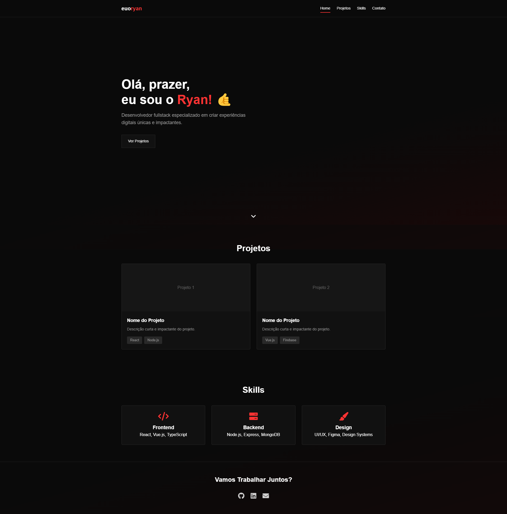

# Projeto

Link de visualização: https://euoryan.com.br/
                       our https://euoryan.github.io

<br/>

## Bem-vindo ao Projeto!
Hey! 👋 Que bom ter você por aqui! Este projeto nasceu da vontade de criar algo realmente especial para desenvolvedores mostrarem seu diretório de links.

<br/>

## Destaques
- Design moderno e minimalista
- Totalmente responsivo
- Animações suaves
- Navegação intuitiva
- Fácil personalização

<br/>

## Tecnologias
```javascript
const techStack = {
    html: "Estrutura semântica",
    css: "Animações e design moderno",
    javascript: "Interatividade suave",
    amor: "Muito ❤️"
}
```

<br/>

## Visualização

### Desktop
<div align="center">
    
</div>

### Mobile
<div align="center">
    <div style="display: flex; justify-content: center; gap: 15px; overflow-x: auto; padding: 20px 0;">
        
        
        
        
    </div>
</div>

<br/>

## Instalação e Uso
1. Clone o repositório
2. Personalize as cores no CSS
3. Adicione seus projetos
4. Seja feliz! 

<br/>

## Sobre
Este projeto é totalmente open source e foi criado para ajudar desenvolvedores a terem uma forma elegante de mostrar seu trabalho. Use, modifique e compartilhe à vontade!

<br/>

## Contato
[](https://github.com/euoryan)
[](https://instagram.com/euoryan)
[](mailto:ryanzera.dev@gmail.com)

<br/>

<div align="center">

Feito com ☕ e código por Ryan ;) Se gostou, deixa uma estrela pra ajudar! ⭐

</div>